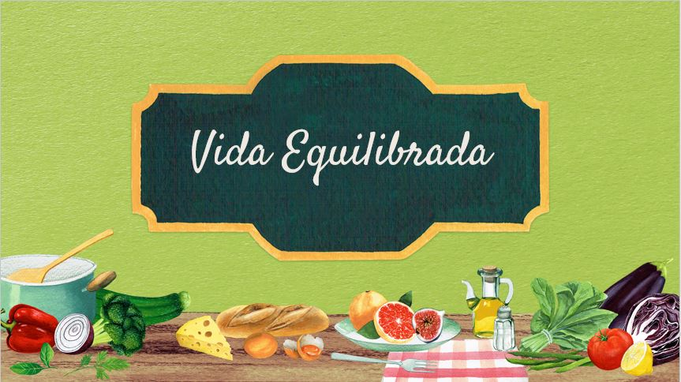

<h6>{Reprograma} - Turma Online 12 - Back-end | 2021 |  🚀</h6>

<h6>Aluna:  Ana Cláudia Almeida de Souza</h6>

<h3 align = "center">Projeto Livre - Vida Equilibrada</h3>

Esta aplicação é uma API com o intuito de ajudar as pessoas que possuem Diabetes mellitus Tipo 1 e se faz necesário o controle da alimentação, para controle e uso correto de insulina, assim como aqueles que desejam ter uma vida saudável. 
O Alimento listado apresentará quantas gramas de carboídrato possuir por unidade.

A API desenvolvida engloba todo o aprendizado durante o Bootcamp Reprograma - Turma Back-end.

Agradecimentos

